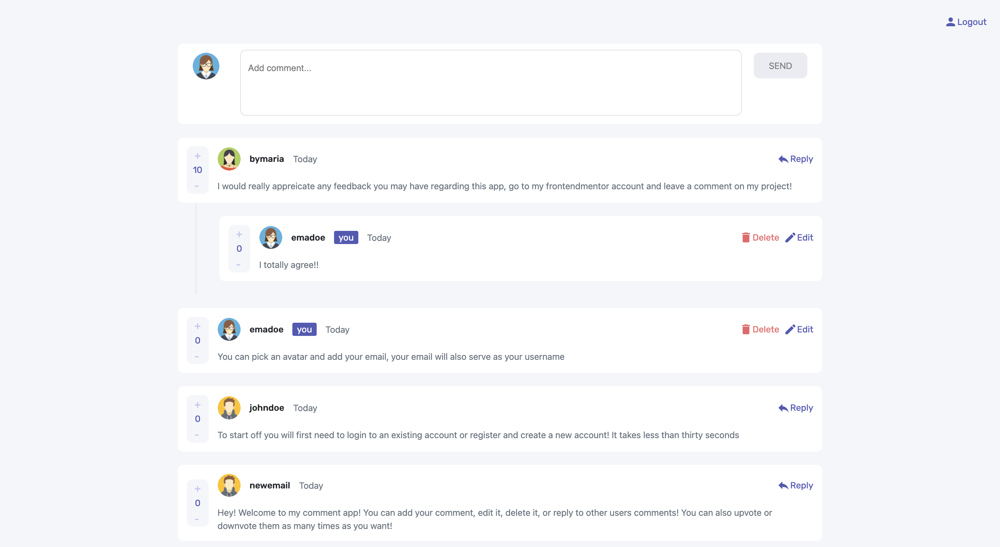
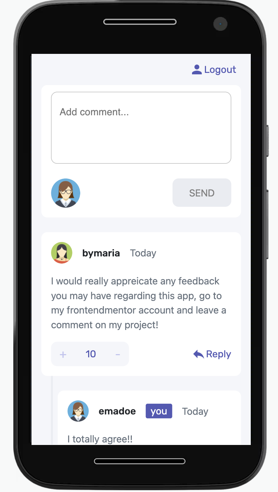

# 💬Interactive comment section

This is a solution to the [Interactive comments section challenge on Frontend Mentor](https://www.frontendmentor.io/challenges/interactive-comments-section-iG1RugEG9). . It was built with React js, using SASS, HTML, JavaScript, and Bootstrap. Firebase was used for user authentication and for database storage. Also, the website is hosted on firebase.

## Table of contents

  - [The challenge](#the-challenge)
  - [Screenshot](#screenshot)
  - [Links](#links)
- [My process](#my-process)
  - [Built with](#built-with)
- [Author](#author)

### 💡The challenge

Users should be able to:

- View the optimal layout for the app depending on their device's screen size
- Create, Read, Update, and Delete comments
- Reply to other comments
- Login and register with an email and password, as well as choose an avatar for their user
- See how many days/weeks ago the comment was posted

### 📷Screenshot

- Desktop: 

- Mobile: 

### 📌Links

- Live Site URL: [Live site url](https://comment-forum-330c8.web.app/)

## 📈My process
First I coded the static design using basic HTML and CSS, with a mobile first workflow. Then I designed the data arquitecture, and I coded the logic that allowed users to comment and edit their text, using firebase database to store the data. After that, I created the login/register page, and used firebase authentication. To finish, I added some restrictions (for instance users can´t reply to their own comments, can´t edit other users comments, etc). 

### 🔨Built with

- Semantic HTML5 markup
- SASS
- Flexbox
- Mobile-first workflow
- [React](https://reactjs.org/) - JS library
- Bootstrap
- Material UI icons
- Firebase database
- Firebase authentication

### 💁🏽‍♀️Author

<!-- - Website - [Maria Peña](https://www.your-site.com) -->
- Frontend Mentor - [@mariapenaa](https://www.frontendmentor.io/profile/mariapenaa)
